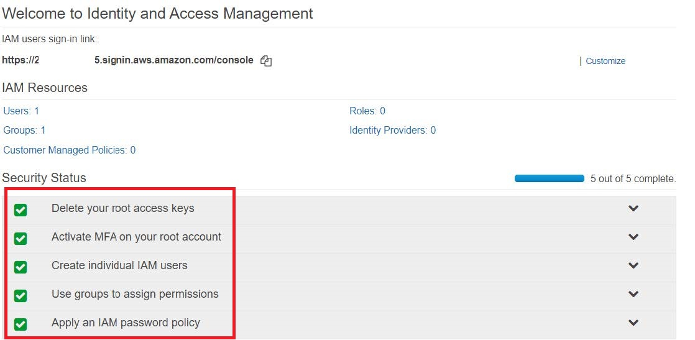
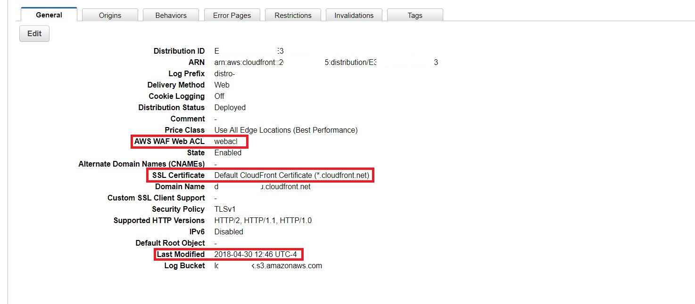
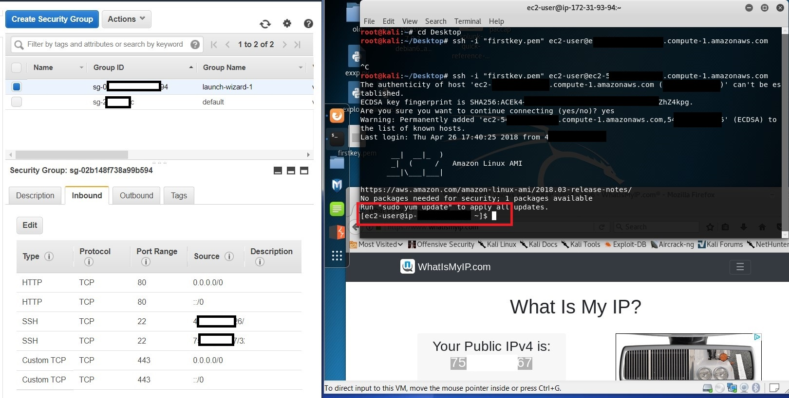

# Basic website containing multiple security features and hosted via AWS. 

**HTML:** account login form with username and password

**CSS:** horizontal navigation bar with hover function on a powderblue background

**JavaScript & Regex:** create-account validation

**PHP & MYSQLI:** prepared statement inserts into mysqli database and bcrypt the passwords

# AWS

**Identity & Access Management (IAM)**
Manage users, permissions and encryption keys in IAM.  I created an Administrator User and Administrators Group and completed the basic security tasks, including deleting root access keys, activating multi-factor authentication (MFA), set permission and applied a password policy.

The image below shows Administrator blocked access to billing details per IAM permissions policy.

**CloudFront Distribution**

CloudFront is a web server for facilitating distribution of web content.  It also helps setting up a firewall for your site.  

The CloudFront configuration below shows the following security-related details: SSL certificate info, the associated ACL, logging info, time & date of last modification, that IPv6 is disabled, 

**Access Control List (ACL)**

ACLs contain firewall-related rules against specific attacks.  The ACL below, **webacl**, contains two rules, **rule1** and **Trend Micro Managed Rules**

The image below shows the ACL associated with the resource containing the EC2 virtual machine.

**rule1** contains a geographic filter to block any requests from outside the US.  **rule1** also contains a additional filters to block cross-site scripting (XSS) and SQL injection attacks.

**Connecting to EC2 Linux AMI virtual machine (VM) ussing SSH**

The image below shows the Security Group configuration that allows web traffic and SSH from specific, authenticated, public IP addresses.  It also shows an SSH connection to the VM from a Kali machine.

**Remove server version from header**

The server version is removed from the webserver header to prevent unnecessarily volunteering detailed server information to attackers. The image below shows the before and after displays regarding configuring httpd.conf ServerToken entry to eliminate the server version from the header.

**Setup Linux-Apache-MySQL-PHP (LAMP) stack on EC2 virtual machine**

The images show the website being created and hosted on the VM and available on the internet via AWS.

The images below show setup of a database for user information.  The password is encrypted with bcrypt and PHP prepared statements are used to prevent SQL injection. 

